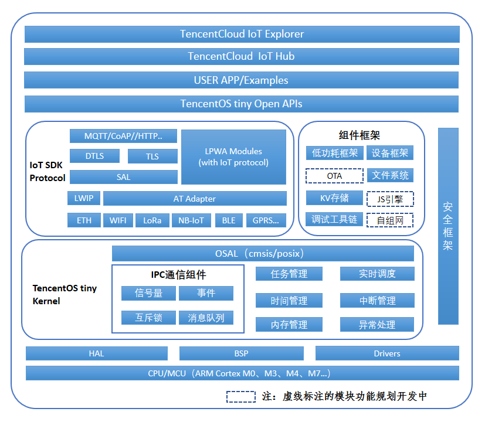

## TencentOS tiny 产品简介
TencentOS tiny是腾讯面向物联网领域开发的实时终端操作系统，具有低功耗，低资源占用，模块化，可裁剪等特性。
TencentOS tiny提供最精简的RTOS内核，内核组件可裁剪可配置，可灵活移植到多种终端MCU上。而且，基于RTOS内核，提供了COAP/MQTT/TLS/DTLS等常用物联网协议栈及组件，方便用户快速接入腾讯云IoT Hub。
TencentOS tiny为物联网终端厂家提供一站式软件解决方案，方便各种物联网设备快速接入腾讯云，可支撑智慧城市、智能水表、智能家居、智能穿戴、车联网等多种行业应用。

TencentOS tiny的优势：

 __1.小体积__ 
最小内核：RAM 0.6KB，ROM 1.8KB
典型LoraWAN及传感器应用：RAM 3.3KB，ROM 12KB
 __2.低功耗__ 
休眠最低功耗低至2 uA
支持外设功耗管理框架，方便开发人员降低设备功耗，延长设备寿命
 __3.丰富的IoT组件__ 
集成主流IoT协议栈（MQTT、CoAP、LoRaWAN、NB-IoT等）
多种通信模组SAL层适配框架，降低网络硬件适配时间成本
支持OTA升级
提供简单易用端云API，加速用户业务接入腾讯云
 __4.可靠的安全框架__ 
多样化的安全分级方案
均衡安全需求&成本控制
 __5.良好的可移植性__ 
内核及IoT组件高度解耦，提供标准适配层
提供自动化移植工具，提升开发效率
 __6.便捷的调试手段__ 
提供云化的最后一屏调试功能
故障现场信息自动上传云平台，方便开发人员调试分析

TencentOS tiny可以有效减少开发人员在任务管理、硬件支持、网络协议支持、安全方案以及文件系统、 KV 存储、在线升级等常用功能组件相关的开发中所需要的时间和工作量，并且能够快速高效的实现设备的低功耗运行，同时提供强大的开发调试功能， 减少开发测试人力成本，能够让客户的产品实现快速开发和快速上线交付。同时，极低的资源占用可有效降低客户产品对硬件规格的需求，可有效降低设备成本。

## TencentOS tiny整体架构

TencentOS tiny主要由一个轻量级RTOS内核+多个物联网组件构成，如下图所示，为TencentOS tiny的主体架构图，从下到上主要包括：

 __CPU库__ ：TencentOS tiny支持的CPU IP核架构，当前主要支持ARM Cortex M0/3/4/7，后续可支持更多IP核，支持更多种类的开发板；

 __驱动管理层__ ：包括板级支持包（BSP，主要由MCU芯片厂家开发与维护）、硬件抽象（HAL，主要由TencentOS tiny提供，方便不同芯片的适配与移植）、设备驱动（Drivers，比如wifi、GPRS、LORA等模块的驱动程序）；

 __内核__ ：TencentOS tiny实时内核包括任务管理、实时调度、时间管理、中断管理、内存管理、异常处理、软件定时器、链表、消息队列、信号量、互斥锁、事件标志等模块；

 __IoT协议栈__ ：TencentOS tiny提供lwip、AT Adapter、SAL层，支持不同的网络硬件，如以太网、串口WIFI、GPRS、NB-IoT、4G等通信模块。TCP/IP网络协议栈上提供常用的物联网协议栈，如COAP、MQTT，支撑终端业务快速接入腾讯云；

 __安全框架__ ：TencentOS tiny为了确保物联网终端数据传输安全以及设备认证安全，提供了比较完整的安全解决方案。安全框架提供的DTLS和TLS安全协议加固了COAP及MQTT的传输层，可确保物联网终端在对接腾讯云时实现安全认证和数据加密；另外针对低资源的终端硬件，安全框架还提供与腾讯云IoTHub配套的密钥认证方案，确保资源受限设备也能在一定程度上实现设备安全认证；

 __组件框架__ ：TencentOS tiny提供文件系统、KV存储、自组网、JS引擎、低功耗框架、设备框架、OTA、调试工具链等一系列组件，供用户根据业务场景选用；

 __开放API__ (规划开发中)：TencentOS tiny将在协议中间件和框架层上提供开放API函数，方便用户调用中间件功能，使用户不用过多关心中间件具体实现，快速对接腾讯云，实现终端业务上云的需求，期望最大程度减少终端物联网产品开发周期，节省开发成本；

 __示例应用__ ：TencentOS tiny提供的示例代码，模块测试代码等，方便用户参考使用。

